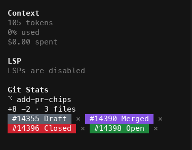
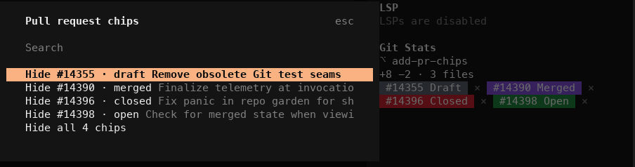

<div align="center">

# opencode-git-stats

**What the working tree looks like right now, and a GitHub-coloured chip for every
pull request your [OpenCode](https://opencode.ai) session touched.**

[](https://www.npmjs.com/package/opencode-git-stats)
[](https://github.com/navbytes/opencode-plugins/actions/workflows/ci.yml)
[](./LICENSE)
[](https://opencode.ai)

</div>



- **Working-tree figures** — total additions, deletions and changed files for the
  whole folder, not just the files this session edited. They come from OpenCode's
  own VCS status endpoint, so they agree with `git status`.
- **Pull request chips** — every GitHub PR whose URL turned up in this session's
  tool output, with GitHub's own state colour: grey **Draft**, green **Open**,
  red **Closed**, purple **Merged**. States refresh on their own as the session
  runs, so a PR you merge mid-session turns purple without a restart.
- **Close a chip** — click the `×` beside it, or run `/prs` to hide one, hide them
  all, or bring the hidden ones back. Dismissals are per session and survive a
  restart.

  
- **Open the PR** — click the chip's label and the pull request opens in your
  browser. (The label is also an OSC 8 hyperlink, but OpenCode keeps mouse tracking
  on, so the terminal hands the click to the plugin rather than following the link
  itself — the plugin opens it.)

## Install

This is a **TUI** plugin, so it goes in `tui.json` (not `opencode.json`):

`~/.config/opencode/tui.json`, or `.opencode/tui.json` in a project —

```json
{
  "$schema": "https://opencode.ai/tui.json",
  "plugin": ["opencode-git-stats@latest"]
}
```

Restart OpenCode. The card appears in the sidebar, just above **Modified Files**.

Requires OpenCode ≥ 1.18. Chip *states* additionally need the
[GitHub CLI](https://cli.github.com) on your `PATH` and logged in (`gh auth
login`); without it the chips still appear, uncoloured, and the card says why.

## What counts as "a PR this session touched"

Any `https://github.com/<owner>/<repo>/pull/<number>` URL that appears in the
output — or the command line — of a tool call in this session. In practice that
is the URL `gh pr create` prints, plus anything a later `gh pr view` or
`gh pr merge` names. Prose in the assistant's replies is deliberately *not*
scanned: only what a command actually produced.

Pull requests the session **created** (the URL came out of a `gh pr create`) sort
ahead of ones it merely referenced. At most 24 chips are tracked per session, so
a stray `gh pr list --json url` cannot fill the sidebar.

### GitHub Enterprise

Only `github.com` is trusted by default, and that is on purpose: the text being
scanned is tool output, which can come from a fetched page or a pasted file, and
the host in a URL is handed to `gh --repo <host>/…`. `gh` treats an unknown host
as Enterprise and would make a request to it — with your Enterprise token
attached. So `github.evil.example` and `github.com.evil.example` are ignored, and
a real Enterprise host has to be named:

```json
{
  "plugin": [["opencode-git-stats@latest", { "hosts": ["github.acme.com"] }]]
}
```

## Commands

| Command | Slash | What it does |
|---|---|---|
| `gitstats.chips` | `/prs`, `/chips` | Hide one chip, hide all of them, or show the hidden ones again |

To put it on a key, add a binding for `gitstats.chips` in your OpenCode keybinds.

## How it works

The plugin is TUI-only and reads everything through OpenCode's official plugin
API:

| What | API |
|---|---|
| working-tree figures | `client.vcs.status()` |
| branch name | `state.vcs.branch` |
| PR sightings | `event.on("message.part.updated")`, plus a catch-up scan of `state.session.messages()` / `state.part()` |
| refresh triggers | `event.on("session.diff")`, `event.on("session.idle")`, a 10 s tick |
| dismissals | `kv` |
| the card | a `sidebar_content` slot at order 450 |

The one thing OpenCode cannot answer is whether a pull request is draft, open,
closed or merged, so the plugin shells out to `gh pr view --json state,isDraft`.
That is the only external call it makes, and it is spawned with an argv array —
never a shell string — for a host on the allow-list above.

A merged pull request is terminal and never re-fetched. Open and draft ones age
out after 90 seconds, closed ones after five minutes, and the end of every turn
marks them all due again. A `gh` call that fails backs that chip off
exponentially, up to about 16 minutes, so a missing or logged-out `gh` is not
re-spawned on every tick; the backoff clears at the end of a turn, in case you
have just installed it. Chips you have dismissed are never fetched at all.

## Development

```sh
bun install
bun run build      # -> dist/tui.js
bun run typecheck
bun test           # unit tests, ~3s
bun run test:e2e   # renders the card in a real TUI, ~4min
```

`bun test` covers the pure functions. `test:e2e` is the one that would notice the
card breaking: it boots the real OpenCode TUI in a pty with the built plugin, against
a real git repo and a real `gh`, and asserts on the composed screen and the raw
terminal bytes — the figures matching what `git` reports, the chip rendering as
`#20 Merged` in GitHub's own purple (`48;2;130;80;223`), a scripted mouse click on
the chip opening the pull request, a click on the `×` dismissing it and opening
nothing, and a logged-out `gh` degrading to `#20 …` with the reason shown.

It is opt-in (`GIT_STATS_E2E=1`) because it needs an authenticated `gh` and takes
minutes; plain `bun test` skips it. Both halves of it have been checked by breaking
the plugin on purpose — removing the click handler and changing the merged colour
each make it fail.

To try a local build, point `tui.json` at the built file:

```json
{ "plugin": ["/absolute/path/to/packages/git-stats/dist/tui.js"] }
```

## The other plugin in this repo

[`opencode-context-tree`](../context-tree/README.md) turns the session itself into a tree
you can branch, merge, crop and undo, with a trajectory view. The two are independent —
install either, or both.

## License

MIT
